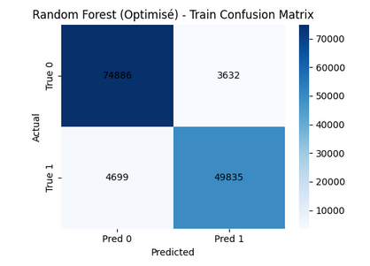
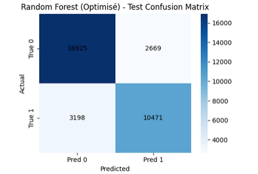
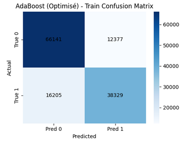
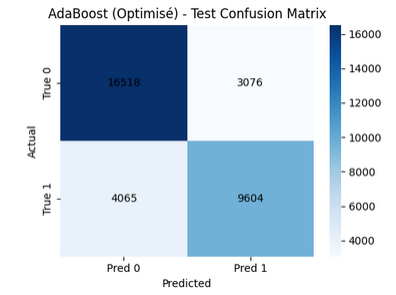
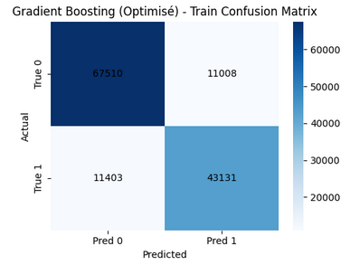
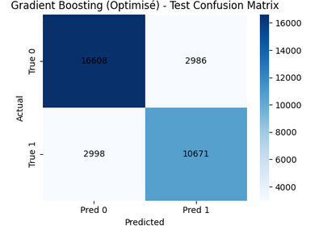

# insa-5a-analyse-descriptive

#  Binôme : AMRI Yassine / Blyweert Mateo

## Jeu de données : pré-traitement

Le jeu de données utilisé est issu de la base **ACS Income**. L’objectif est de prédire si un individu dispose d’un revenu annuel supérieur à 50 000 dollars.

La variable cible est **`PINCP`**, initialement booléenne, qui a été transformée en variable binaire :
- `1` : revenu supérieur à 50k
- `0` : revenu inférieur ou égal à 50k

### Liste des features et signification

Les variables explicatives utilisées sont :

- **AGEP** : âge de l’individu  
- **WKHP** : nombre d’heures travaillées par semaine  
- **COW** (*Class of Worker*) : type d’emploi  
- **SCHL** : niveau d’éducation atteint  
- **MAR** : statut marital  
- **OCCP** : catégorie socioprofessionnelle  
- **POBP** : pays de naissance  
- **RELP** : lien de parenté avec le chef du ménage  
- **SEX** : sexe  
- **RAC1P** : groupe racial principal  

Ces variables comprennent à la fois des variables numériques et catégorielles.

### Pré-traitement appliqué

- La variable cible `PINCP` a été binarisée.
- Les variables catégorielles (`COW`, `SCHL`, `MAR`, `OCCP`, `POBP`, `RELP`, `SEX`, `RAC1P`) ont été encodées par **one-hot encoding** avec `drop_first=True` afin d’éviter la redondance.
- Aucune normalisation n’a été appliquée, car les modèles utilisés ne sont pas sensibles à l’échelle des variables.

Après encodage, le jeu de données contient **808 variables explicatives**.

---

## Expérimentation 1 : Comparaison de modèles par défaut

### Jeux de données utilisé :
- **Taille ensemble d’entraînement** : 133 052 lignes × 808 colonnes  
- **Taille ensemble de test** : 33 263 lignes × 808 colonnes  

### Résultats (hyper-paramètres par défaut)

#### Évaluation en entraînement

| Evaluation en train | Random Forest | AdaBoost | XGBoost |
|--------------------|---------------|----------|---------|
| Accuracy           | 0.9981        | 0.7781   | 0.7995  |
| Temps de calcul (s)| ~110          | ~48      | ~132    |
| Matrice confusion  | cf. notebook  | cf. notebook | cf. notebook |

#### Évaluation en test

| Evaluation en test | Random Forest | AdaBoost | XGBoost |
|-------------------|---------------|----------|---------|
| Accuracy          | 0.8130        | 0.7771   | 0.7986  |
| Temps de calcul (s)| ~110         | ~48      | ~132    |
| Matrice confusion | cf. notebook  | cf. notebook | cf. notebook |

### Commentaires et analyse

Le Random Forest par défaut obtient une accuracy très élevée en entraînement, indiquant un fort sur-apprentissage. AdaBoost et Gradient Boosting présentent des performances plus équilibrées, mais avec une accuracy globale légèrement inférieure. Ces résultats motivent une phase d’optimisation des hyperparamètres.

---

## Expérimentation 2 : Comparaison Modèles ML optimisés

### Jeux de données utilisé :
- **Taille ensemble d’entraînement** : 133 052 lignes × 808 colonnes  
- **Taille ensemble de test** : 33 263 lignes × 808 colonnes  

---

### Random Forest (RF)

#### Processus d’entraînement
Une recherche d’hyperparamètres a été réalisée via **GridSearchCV** afin de réduire le sur-apprentissage observé en Expérimentation 1.

**Hyperparamètres testés :**
- `n_estimators` : [200, 400]  
- `max_depth` : [10, 20, None]  
- `min_samples_split` : [2, 10]  
- `max_features` : ["sqrt", "log2"]

- **Nombre de plis** : 3  
- **Nombre total d’entraînements** : 72  

#### Résultats
- **Meilleurs hyperparamètres** :  
  `n_estimators=400`, `max_depth=None`, `min_samples_split=10`, `max_features=log2`

- **Performances entraînement**
  - Accuracy : 0.9374  
  - Temps : 64.82 s  
  - Matrice de confusion : cf. notebook  

  

- **Performances test**
  - Accuracy : 0.8236  
  - Temps : 64.82 s  
  - Matrice de confusion : cf. notebook  

  
**Analyse :**  
L’optimisation permet une diminution du sur-apprentissage et une amélioration de l’accuracy sur test. Le Random Forest optimisé présente une meilleure capacité de généralisation.

---

### AdaBoost

#### Processus d’entraînement

**Hyperparamètres testés :**
- `n_estimators` : [50, 200, 400]  
- `learning_rate` : [0.01, 0.1, 1.0]

- **Nombre de plis** : 3  
- **Nombre total d’entraînements** : 27  

#### Résultats
- **Meilleurs hyperparamètres** :  
  `n_estimators=300`, `learning_rate=0.5`

- **Performances entraînement**
  - Accuracy : 0.7852  
  - Temps : 137.06 s  

  

- **Performances test**
  - Accuracy : 0.7853  
  - Temps : 137.06 s  

  

**Analyse :**  
AdaBoost montre une bonne stabilité avec peu de sur-apprentissage, mais des performances globales inférieures à celles du Random Forest et du Gradient Boosting.

---

### XGBoost (Gradient Boosting)

#### Processus d’entraînement

**Hyperparamètres testés :**
- `n_estimators` : [100, 200, 300]  
- `learning_rate` : [0.01, 0.1, 0.5]  
- `max_depth` : [3, 5]

- **Nombre de plis** : 3  
- **Nombre total d’entraînements** : 54  

#### Résultats
- **Meilleurs hyperparamètres** :  
  `n_estimators=200`, `learning_rate=0.5`, `max_depth=3`

- **Performances entraînement**
  - Accuracy : 0.8316  
  - Temps : 163.89 s  

  

- **Performances test**
  - Accuracy : 0.8201  
  - Temps : 163.89 s  

  

**Analyse :**  
Gradient Boosting bénéficie fortement de l’optimisation et atteint des performances proches du Random Forest optimisé, avec un bon compromis biais/variance, au prix d’un temps de calcul plus élevé.

## Expérimentation 3 : Comparaison des meilleurs modèles

### Jeux de données utilisé :
- **Taille ensemble d’entraînement** : 133 052 lignes × 808 colonnes  
- **Taille ensemble de test** : 33 263 lignes × 808 colonnes  

Les modèles comparés correspondent aux **meilleures configurations obtenues en Expérimentation 2** pour chaque algorithme.

---

### Résultats des meilleurs modèles obtenus dans l’Expérimentation 2

#### Évaluation en entraînement

| Evaluation en train | Random Forest | AdaBoost | XGBoost |
|--------------------|---------------|----------|---------|
| Accuracy           | 0.9374        | 0.7852   | 0.8316  |
| Temps calcul (s)   | 64.82         | 137.06   | 163.89  |
| Matrice confusion  | cf. Expé 2    | cf. Expé 2 | cf. Expé 2 |

---

#### Évaluation en test

| Evaluation en test | Random Forest | AdaBoost | XGBoost |
|-------------------|---------------|----------|---------|
| Accuracy          | **0.8236**    | 0.7853   | 0.8201  |
| Temps calcul (s)  | 64.82         | 137.06   | 163.89  |
| Matrice confusion | cf. Expé 2    | cf. Expé 2 | cf. Expé 2 |

---

### Commentaires et Analyse

L’Expérimentation 3 met en évidence les différences de performance et de comportement entre les meilleurs modèles issus de l’optimisation.

Le **Random Forest optimisé** obtient la meilleure accuracy sur l’ensemble de test (0.8236), tout en conservant un temps de calcul relativement faible. La diminution de l’écart entre les performances en entraînement et en test indique une bonne capacité de généralisation.

Le **Gradient Boosting optimisé** présente des performances très proches de celles du Random Forest, avec une accuracy test de 0.8201. Il offre un bon compromis biais/variance, mais son temps de calcul est plus élevé, ce qui le rend moins avantageux dans un contexte de coût computationnel.

L’**AdaBoost optimisé** est le modèle le plus stable, avec des performances similaires en entraînement et en test, mais son accuracy reste inférieure à celle des deux autres modèles. Il est donc moins performant globalement sur ce jeu de données.

Au regard des résultats obtenus, le **Random Forest optimisé** apparaît comme le meilleur compromis entre performance, robustesse et temps de calcul. Il est retenu comme **modèle final pour la suite du projet**, notamment pour les analyses d’explicabilité.

## Expérimentation 4 : inférence sur un autre jeu de données (optionnel)

Cette expérimentation vise à évaluer la capacité de généralisation des modèles optimisés sur un jeu de données complémentaire correspondant à l’État du Colorado. Les trois modèles optimisés obtenus lors de l’Expérimentation 2 (Random Forest, AdaBoost et XGBoost) ont été appliqués sans ré-entraînement.

Le même pipeline de pré-traitement que pour le jeu de données initial a été utilisé, incluant l’encodage one-hot des variables catégorielles et l’alignement des features. Une adaptation mineure a été effectuée sur le format du label PINCP, déjà encodé en binaire dans ce jeu de données.

### Résultats obtenus sur le jeu de données du Colorado

| Modèle | Accuracy |
|------|----------|
| Random Forest (optimisé) | **0.7858** |
| AdaBoost (optimisé) | 0.7630 |
| XGBoost (optimisé) | 0.7839 |

### Matrices de confusion

**Random Forest (optimisé)**  
[[13660 4674]

[ 2033 10939]]

 
**AdaBoost (optimisé)**  
[[13833 4501]

[ 2920 10052]]

**XGBoost (optimisé)**  
[[13470 4864]

[ 1901 11071]]

Les résultats obtenus montrent que le Random Forest optimisé conserve la meilleure performance globale sur le jeu de données du Colorado, avec une accuracy de 0.7858. Le XGBoost optimisé présente des performances très proches, confirmant une bonne capacité de généralisation. L’AdaBoost optimisé reste en retrait, notamment en raison d’un nombre plus élevé de faux négatifs.

Malgré une légère baisse de performance par rapport au jeu de test initial, la hiérarchie entre les modèles reste inchangée. Ces résultats confirment la robustesse des modèles optimisés et justifient le choix du Random Forest comme modèle final pour la suite du projet.

### Résultats obtenus sur le jeu de données du Nevada

| Modèle | Accuracy |
|------|----------|
| Random Forest (optimisé) | **0.7553** |
| AdaBoost (optimisé) | 0.7314 |
| XGBoost (optimisé) | 0.7420 |

### Matrices de confusion

**Random Forest (optimisé)**  

[[5361 2056]

[ 583 2785]]

**AdaBoost (optimisé)**  

[[5274 2143]

[ 754 2614]]

**XGBoost (optimisé)**  

[[5180 2237]

[ 546 2822]]

### Analyse

Les performances obtenues sur le jeu de données du Nevada sont globalement inférieures à celles observées sur la Californie et le Colorado, ce qui peut s’expliquer par des différences structurelles dans la distribution des revenus et des variables socio-démographiques. Néanmoins, la hiérarchie entre les modèles reste stable.

Le Random Forest optimisé demeure le modèle le plus performant avec une accuracy de 0.7553, suivi du XGBoost optimisé (0.7420). L’AdaBoost optimisé affiche les performances les plus faibles, avec un nombre plus élevé de faux négatifs, traduisant une moindre capacité à détecter les individus appartenant à la classe des revenus supérieurs à 50 000 dollars.

Ces résultats confirment la robustesse du Random Forest optimisé, qui conserve de bonne

## Expérimentation 5 : impact de la taille du jeu de données

Cette expérimentation vise à analyser l’influence de la taille du jeu d’entraînement sur les performances du modèle retenu, à savoir le Random Forest optimisé. Le modèle a été entraîné sur différentes proportions du jeu d’entraînement (10 %, 25 %, 50 %, 75 % et 100 %) et évalué sur un même jeu de test afin de garantir une comparaison équitable.

### Résultats obtenus

Les résultats montrent que l’accuracy sur le jeu de test augmente progressivement avec la taille du jeu d’entraînement. L’amélioration est significative entre 10 % et 50 % des données, puis devient plus marginale au-delà de 75 %. À 100 % des données, l’accuracy atteint 0.8187, ce qui représente un gain limité par rapport à l’utilisation de 75 % des données.

Parallèlement, le temps d’entraînement augmente fortement avec la taille du jeu de données, passant d’environ 2.7 secondes pour 10 % des données à plus de 60 secondes pour l’ensemble du jeu d’entraînement.

### Analyse

Ces résultats mettent en évidence un compromis entre performance et coût computationnel. Si l’utilisation de l’ensemble des données permet d’obtenir la meilleure performance, les gains deviennent faibles par rapport à l’augmentation significative du temps de calcul. Une taille intermédiaire du jeu d’entraînement permet ainsi d’obtenir des performances proches du maximum tout en réduisant le coût computationnel.
