# insa-5a-analyse-descriptive

#  Binôme : AMRI Yassine / Blyweert Mateo

## Jeu de données : pré-traitement

Le jeu de données utilisé est issu de la base **ACS Income**. L’objectif est de prédire si un individu dispose d’un revenu annuel supérieur à 50 000 dollars.

La variable cible est **`PINCP`**, initialement booléenne, qui a été transformée en variable binaire :
- `1` : revenu supérieur à 50k
- `0` : revenu inférieur ou égal à 50k

### Liste des features et signification

Les variables explicatives utilisées sont :

- **AGEP** : âge de l’individu  
- **WKHP** : nombre d’heures travaillées par semaine  
- **COW** (*Class of Worker*) : type d’emploi  
- **SCHL** : niveau d’éducation atteint  
- **MAR** : statut marital  
- **OCCP** : catégorie socioprofessionnelle  
- **POBP** : pays de naissance  
- **RELP** : lien de parenté avec le chef du ménage  
- **SEX** : sexe  
- **RAC1P** : groupe racial principal  

Ces variables comprennent à la fois des variables numériques et catégorielles.
    
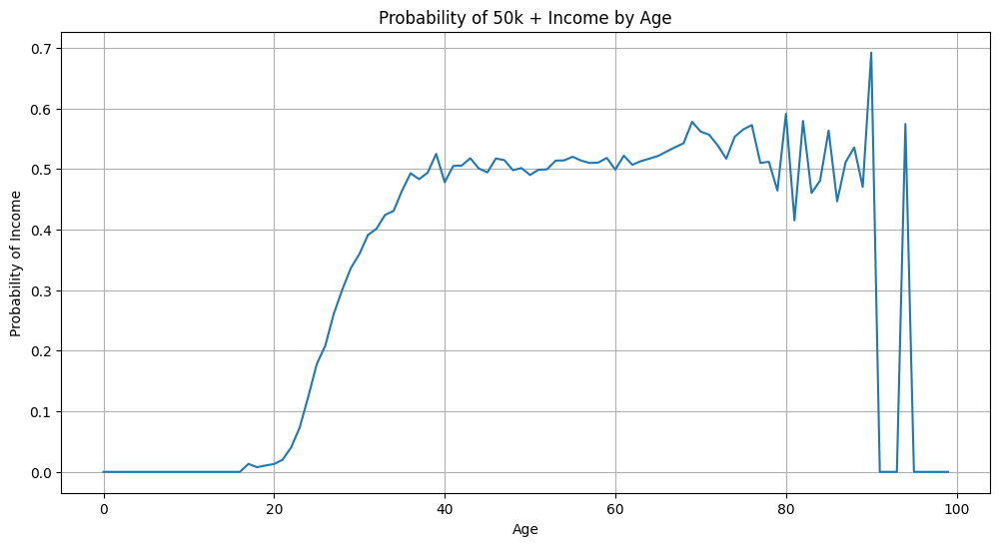
    

    
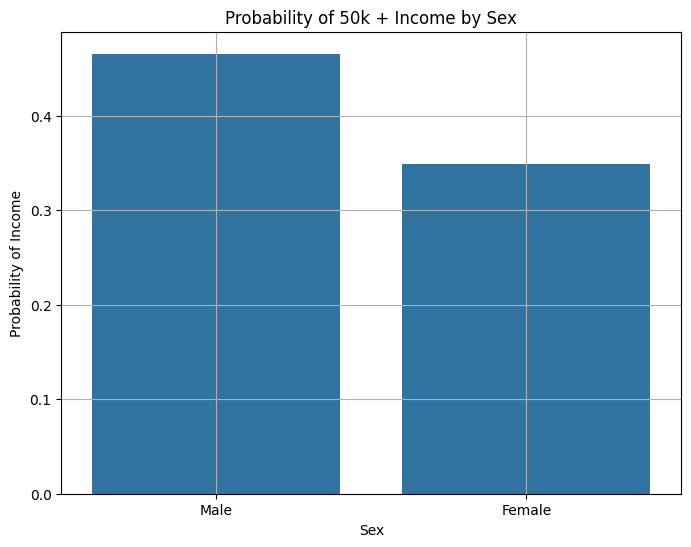
    

    
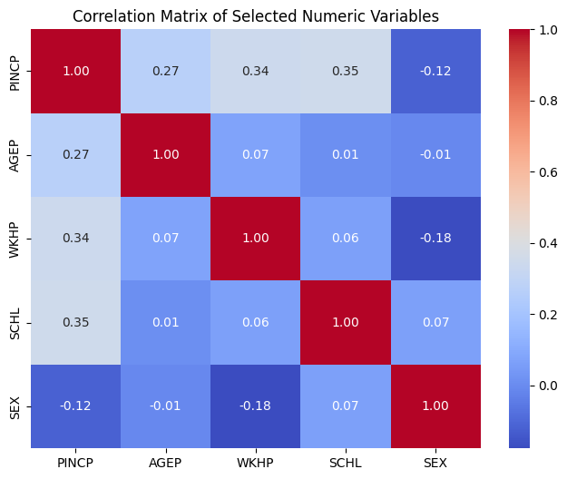
    

### Pré-traitement appliqué

- La variable cible `PINCP` a été binarisée.
- Les variables catégorielles (`COW`, `SCHL`, `MAR`, `OCCP`, `POBP`, `RELP`, `SEX`, `RAC1P`) ont été encodées par **one-hot encoding** avec `drop_first=True` afin d’éviter la redondance.
- Aucune normalisation n’a été appliquée, car les modèles utilisés ne sont pas sensibles à l’échelle des variables.

Après encodage, le jeu de données contient **808 variables explicatives**.

 ## Expérimentation 1 : Comparaison de modèles par défaut

### Jeux de données utilisé :
- **Taille ensemble d’entraînement** : 133 052 lignes × 808 colonnes  
- **Taille ensemble de test** : 33 263 lignes × 808 colonnes  

### Résultats (hyper-paramètres par défaut)

#### Évaluation en entraînement

| Evaluation en train | Random Forest | AdaBoost | XGBoost |
|--------------------|---------------|----------|---------|
| Accuracy           | 0.9981        | 0.7781   | 0.7995  |
| Temps de calcul (s)| 78.64          | 24.18      | 92.94    |
| Matrice confusion  | figure | figure| figure |
    
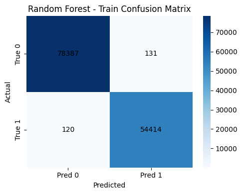
    

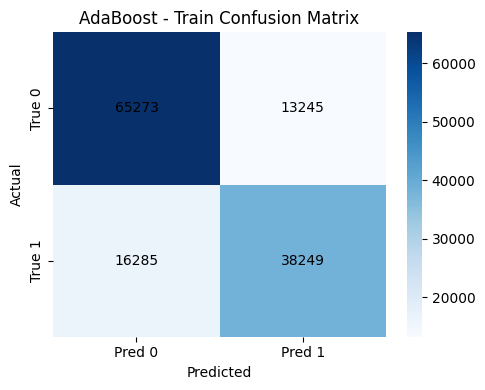

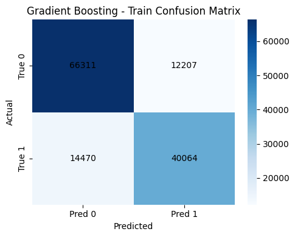

#### Évaluation en test

| Evaluation en test | Random Forest | AdaBoost | XGBoost |
|-------------------|---------------|----------|---------|
| Accuracy          | 0.8130        | 0.7771   | 0.7986  |
| Matrice confusion | cf. notebook  | cf. notebook | cf. notebook |

    
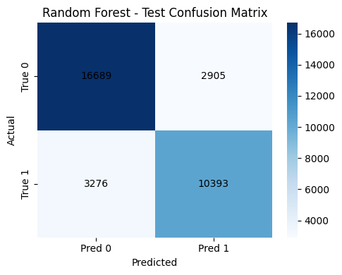

    

    

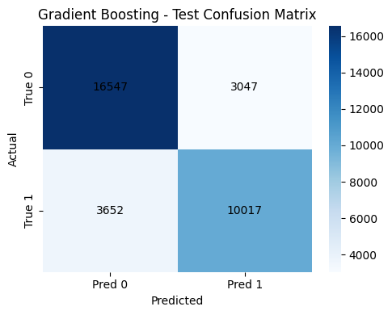

    

### Commentaires et analyse

Le Random Forest par défaut obtient une accuracy très élevée en entraînement (plus de 99,8% !), ce qui montre un sur-apprentissage. AdaBoost et Gradient Boosting présentent des performances plus équilibrées, mais avec une accuracy globale légèrement inférieure. Ces résultats expliquent pourquoi une phase d’optimisation des hyperparamètres est nécessaire afin d'obtenir les meilleurs résultats possibles.

    

---

## Expérimentation 2 : Comparaison Modèles ML optimisés

### Jeux de données utilisé :
- **Taille ensemble d’entraînement** : 133 052 lignes × 808 colonnes  
- **Taille ensemble de test** : 33 263 lignes × 808 colonnes  

---

### Random Forest (RF)

#### Processus d’entraînement
Une recherche d’hyperparamètres a été réalisée via **GridSearchCV** afin de réduire le sur-apprentissage observé en Expérimentation 1.

**Hyperparamètres testés :**
- `n_estimators` : [200, 400]  
- `max_depth` : [10, 20, None]  
- `min_samples_split` : [2, 10]  
- `max_features` : ["sqrt", "log2"]

- **Nombre de plis** : 3  
- **Nombre total d’entraînements** : 72  

#### Résultats
- **Meilleurs hyperparamètres** :  
  `n_estimators=400`, `max_depth=None`, `min_samples_split=10`, `max_features=log2`

- **Performances entraînement**
  - Accuracy : 0.9374  
  - Matrice de confusion : cf. notebook  

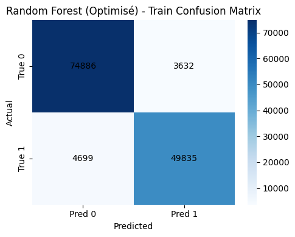

- **Performances test**
  - Accuracy : 0.8236  
  - Matrice de confusion : cf. notebook  

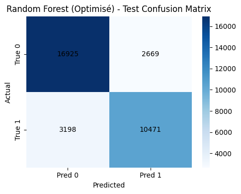

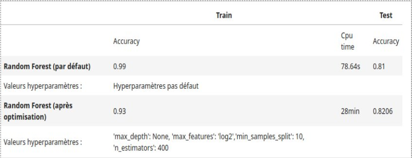

**Analyse :**  
L’optimisation permet une diminution du sur-apprentissage et une amélioration de l’accuracy lors des tests. Le Random Forest optimisé présente une meilleure capacité de généralisation.

---

### AdaBoost

#### Processus d’entraînement

**Hyperparamètres testés :**
- `n_estimators` : [50, 200, 400]  
- `learning_rate` : [0.01, 0.1, 1.0]

- **Nombre de plis** : 3  
- **Nombre total d’entraînements** : 27  

#### Résultats
- **Meilleurs hyperparamètres** :  
  `n_estimators=300`, `learning_rate=0.5`

- **Performances entraînement**
  - Accuracy : 0.7852  

 

    

- **Performances test**
  - Accuracy : 0.7853  

    

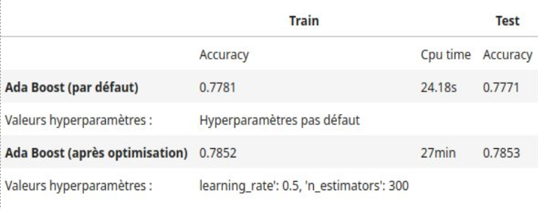

**Analyse :**  
AdaBoost montre une bonne stabilité avec peu de sur-apprentissage, mais des performances globales inférieures à celles du Random Forest et du Gradient Boosting.

---

### XGBoost (Gradient Boosting)

#### Processus d’entraînement

**Hyperparamètres testés :**
- `n_estimators` : [200, 500]  
- `learning_rate` : [0.05, 0.1]  
- `max_depth` : [1, 3, 6]

- **Nombre de plis** : 3  
- **Nombre total d’entraînements** : 54  

#### Résultats
- **Meilleurs hyperparamètres** :  
  `{'learning_rate': 0.1, 'max_depth': 6, 'n_estimators': 500}`

- **Performances entraînement**
  - Accuracy : 0.8316  

   
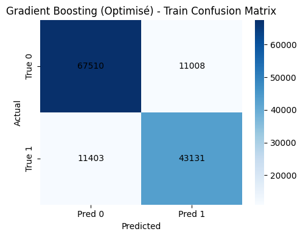

- **Performances test**
  - Accuracy : 0.8216  

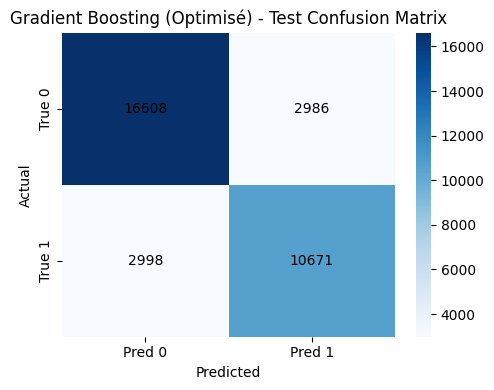
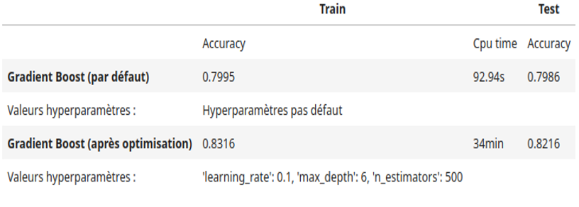

**Analyse :**  
Le modèle de Gradient Boosting bénéficie fortement de l’optimisation des hyperparamètres. Il atteint des performances sur l’ensemble de test très proches de celles du Random Forest optimisé, tout en maintenant un meilleur équilibre. Malgré un temps de calcul plus élevé, ce modèle offre un excellent compromis entre performance prédictive et capacité de généralisation, ce qui en fait le modèle le plus pertinent pour la suite de l’étude, notamment pour les analyses d’explicabilité.

## Expérimentation 3 : Comparaison des meilleurs modèles

### Jeux de données utilisé :
- **Taille ensemble d’entraînement** : 133 052 lignes × 808 colonnes  
- **Taille ensemble de test** : 33 263 lignes × 808 colonnes  

Les modèles comparés correspondent aux **meilleures configurations obtenues en Expérimentation 2** pour chaque algorithme.

    
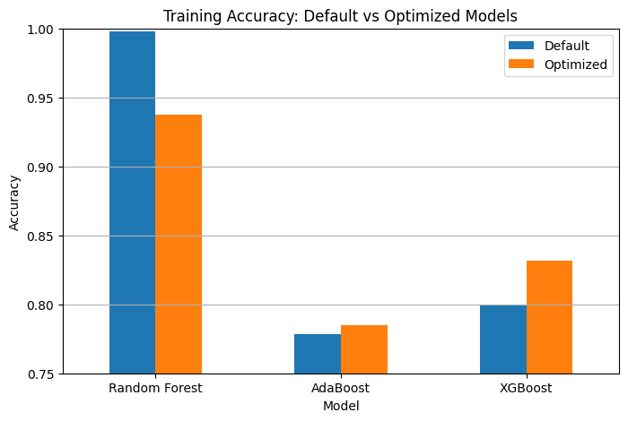
    

    
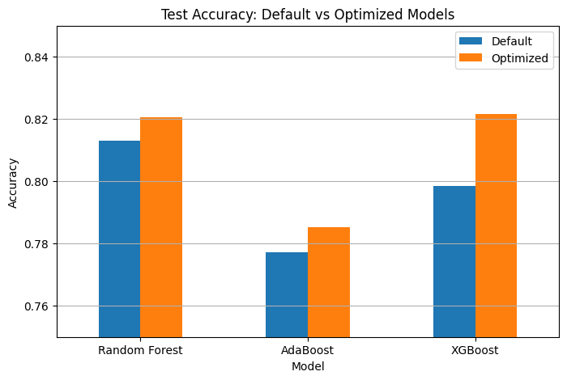
    

### Commentaires et Analyse

L’Expérimentation 3 met en évidence les différences de performance et de comportement entre les meilleurs modèles issus de l’optimisation.
Le **Random Forest optimisé** obtient une très bonne accuracy sur l’ensemble de test (0.8206), tout en conservant un temps de calcul relativement faible. La réduction de l’écart entre les performances en entraînement et en test par rapport aux modèles par défaut indique une bonne capacité de généralisation et une diminution du sur-apprentissage.

Le **Gradient Boosting optimisé** présente les meilleures performances globales parmi les trois modèles, avec une accuracy en test de 0.8216. Il offre un bon équilibre et une meilleure régularité des prédictions. En contrepartie, son temps de calcul est plus élevé, ce qui peut constituer une contrainte dans des contextes nécessitant une forte efficacité computationnelle.

L’**AdaBoost optimisé** est le modèle le plus stable, avec des performances très proches entre l’entraînement et le test, traduisant un sur-apprentissage limité. Cependant, son accuracy reste inférieure à celle des deux autres modèles, ce qui le rend moins performant sur ce jeu de données.

Au regard de l’ensemble des résultats obtenus, le **Gradient Boosting optimisé** apparaît comme le meilleur compromis global entre performance prédictive, robustesse et capacité de généralisation. Il est donc retenu comme modèle final pour la suite du projet, en particulier pour les analyses d’explicabilité des prédictions.

## Expérimentation 4 : inférence sur un autre jeu de données

L’Expérimentation 4 permet d’évaluer la capacité de généralisation des modèles optimisés lorsqu’ils sont appliqués à des jeux de données provenant d’autres États, sans phase de ré-entraînement. Cette démarche met en évidence la robustesse des modèles face à des distributions de données légèrement différentes.

Sur le jeu de données du Colorado, le Gradient Boosting optimisé (XGBoost) obtient la meilleure accuracy (0.7856), suivi de très près par le Random Forest (0.7839). Ces résultats montrent que les modèles entraînés sur les données de Californie conservent de bonnes performances sur un État présentant des caractéristiques socio-économiques comparables, ce qui témoigne d’une bonne capacité de transfert.

### Résultats obtenus sur le jeu de données du Colorado

| Modèle | Accuracy |
|------|----------|
| Random Forest (optimisé) | 0.7839 |
| AdaBoost (optimisé) | 0.7630 |
| XGBoost (optimisé) | **0.7856** |

Sur le jeu de données du Nevada, les performances globales diminuent pour l’ensemble des modèles, avec des accuracies comprises entre 0.73 et 0.76. Le Random Forest optimisé obtient cette fois la meilleure performance (0.7553), tandis que le Gradient Boosting et l’AdaBoost présentent des résultats légèrement inférieurs. Cette baisse de performance peut s’expliquer par des différences plus marquées dans la distribution des variables (répartition des professions, niveaux de revenus ou caractéristiques démographiques).
### Résultats obtenus sur le jeu de données du Nevada

| Modèle | Accuracy |
|------|----------|
| Random Forest (optimisé) | **0.7553** |
| AdaBoost (optimisé) | 0.7314 |
| XGBoost (optimisé) | 0.7420 |

    
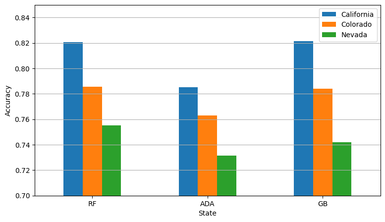
    
### Analyse des 3 datasets

L’analyse comparative sur les trois États (California, Colorado, Nevada) met en évidence une tendance générale :

- le Gradient Boosting optimisé reste le modèle le plus robuste et le plus performant en moyenne,

- le Random Forest optimisé montre une très bonne stabilité et parfois de meilleures performances lorsque les distributions changent davantage,

- l’AdaBoost optimisé reste systématiquement en retrait, bien qu’il conserve une bonne stabilité.

Ces résultats confirment que les modèles optimisés, et en particulier le Gradient Boosting, possèdent une bonne capacité de généralisation inter-États, tout en soulignant l’impact des différences de distribution des données sur les performances prédictives.

## Expérimentation 5 : impact de la taille du jeu de données

Cette expérimentation vise à analyser l’influence de la taille du jeu d’entraînement sur les performances du modèle retenu, à savoir le Random Forest optimisé. Le modèle a été entraîné sur différentes proportions du jeu d’entraînement (10 %, 25 %, 50 %, 75 % et 100 %) et évalué sur un même jeu de test afin de garantir une comparaison équitable.

### Résultats obtenus

Les résultats montrent que l’accuracy sur le jeu de test augmente progressivement avec la taille du jeu d’entraînement. L’amélioration est significative entre 10 % et 50 % des données, puis devient plus lente au-delà de 75 %. À 100 % des données, l’accuracy atteint 0.8187, ce qui représente un gain limité par rapport à l’utilisation de 75 % des données.

Parallèlement, le temps d’entraînement augmente fortement avec la taille du jeu de données, passant d’environ 2.7 secondes pour 10 % des données à plus de 60 secondes pour l’ensemble du jeu d’entraînement.

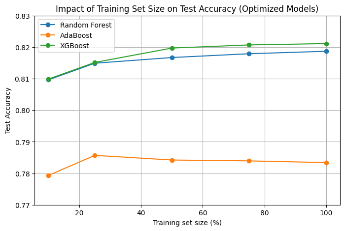

### Analyse

Ces résultats mettent en évidence un compromis entre performance et complexité. Si l’utilisation de l’ensemble des données permet d’obtenir la meilleure performance, les gains deviennent faibles par rapport à l’augmentation significative du temps de calcul. Une taille intermédiaire du jeu d’entraînement permet ainsi d’obtenir des performances proches du maximum tout en réduisant le coût computationnel.

## 3. Explicabilité des prédictions

Dans cette section, nous analysons les prédictions du modèle le plus performant obtenu lors de l’expérimentation 2, à savoir le **Gradient Boost optimisé**, afin de mieux comprendre les mécanismes de décision du modèle. Nous utilisons des méthodes d’explicabilité globales et locales, ainsi qu’une approche contrefactuelle.

---

### 3.1 Classement des attributs dans la prédiction (explication globale)

#### Principe de la méthode

Afin d’évaluer l’importance des attributs dans les décisions du modèle, nous utilisons la méthode de **permutation feature importance**.  
Le principe est le suivant :

- On mesure d’abord la performance du modèle sur un jeu de données de référence.
- Puis, pour chaque attribut, on permute aléatoirement ses valeurs entre les individus.
- On mesure la perte de performance induite par cette permutation.
- Plus la performance diminue, plus l’attribut est jugé important pour le modèle.

Cette méthode est **spécifique au modèle**, facile à interpréter et permet d’obtenir une vision globale de l’influence des variables.

#### Implémentation

En raison de la taille importante du jeu de données et du nombre élevé de variables (après encodage one-hot), la permutation a été réalisée sur un **sous-échantillon du jeu de test** afin de réduire le temps de calcul et les contraintes mémoire.  
Les paramètres utilisés sont :
- nombre de répétitions : faible (2 à 3)
- calcul en mode séquentiel (`n_jobs=1`)

#### Résultats et interprétation

Le graphique de permutation importance met en évidence que les attributs les plus influents sont principalement liés à :

- le **nombre d’heures travaillées par semaine (WKHP)**,
- l’**âge (AGEP)**
    
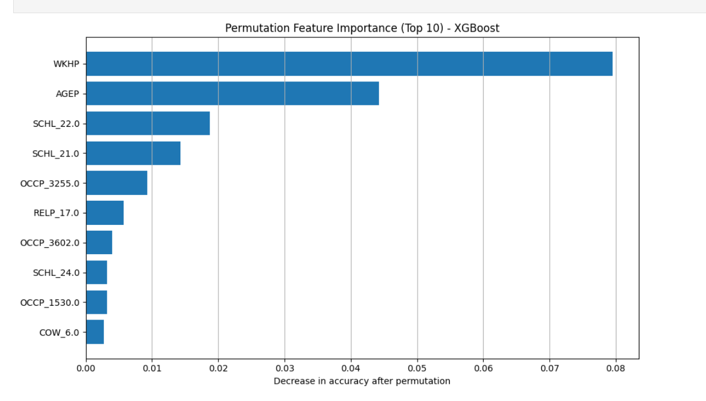
    

### 3.2 Explications locales

#### 3.2.1 LIME

##### Principe

LIME (Local Interpretable Model-agnostic Explanations) est une méthode d’explication locale qui vise à expliquer la prédiction d’un **individu précis**.  
Elle fonctionne en :
- générant des perturbations autour de l’exemple étudié,
- observant les variations de prédiction,
- ajustant un modèle linéaire localement pour approximer le comportement du modèle complexe.

##### Implémentation

Nous avons utilisé la librairie `lime` pour expliquer les prédictions de plusieurs individus du jeu de test.  
Pour chaque individu sélectionné :
- les 10 attributs les plus influents localement sont affichés,
- un graphique en barres indique les contributions positives (en vert) et négatives (en rouge) à la prédiction de la classe `>50k`.

##### Analyse des résultats

Les graphiques LIME montrent que, pour un individu donné :
- certaines professions ou catégories socio-professionnelles ont un impact négatif fort,
- d’autres attributs comme certaines origines ou catégories professionnelles contribuent positivement à la prédiction,
- la décision finale résulte d’un **équilibre entre contributions positives et négatives**.

LIME permet ainsi de comprendre **pourquoi le modèle a pris une décision précise pour un individu donné**, ce qui est essentiel pour l’interprétabilité et la confiance dans le modèle.

    
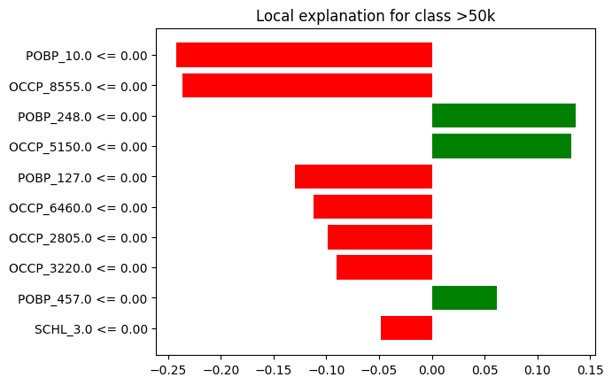
    
    
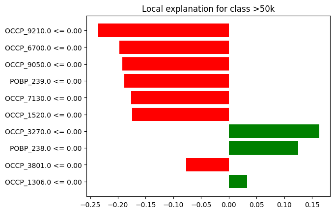
    

---

#### 3.2.2 SHAP

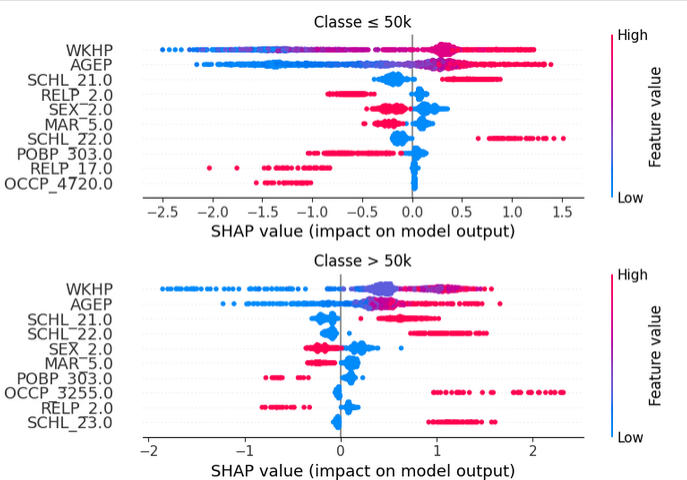
---

#### 3.2.3 Comparaison LIME / SHAP

Les méthodes LIME et SHAP ont été utilisées afin de fournir des explications locales et globales des prédictions du modèle Gradient Boosting optimisé.

LIME fournit des explications locales, spécifiques à un individu donné. Pour chaque observation analysée, LIME approxime localement le modèle complexe par un modèle linéaire interprétable. Les résultats obtenus montrent quels attributs ont contribué positivement ou négativement à la prédiction pour un individu précis. Cette approche est intuitive et facile à interpréter, mais dépend fortement de l’échantillonnage local.

SHAP, en revanche, repose sur une base théorique issue de la théorie des jeux. Il permet d’obtenir à la fois des explications locales (waterfall plots) et globales (summary plots). Contrairement à LIME, SHAP garantit une cohérence globale des contributions des variables.

En comparaison, LIME est plus adapté à l’explication ponctuelle d’un individu, tandis que SHAP permet une compréhension globale et plus robuste du comportement du modèle. Les deux approches sont complémentaires.

---

#### 3.2.4 Approfondissement SHAP – summary plot

Le graphique summary_plot SHAP met en évidence les attributs ayant le plus fort impact sur la prédiction de la classe >50k.

Les résultats montrent que :

WKHP (nombre d’heures travaillées) est l’attribut le plus influent,

AGEP (âge) joue également un rôle majeur,

le niveau d’éducation (SCHL) et certaines catégories professionnelles (OCCP) contribuent significativement à la décision.

Les couleurs indiquent la valeur de l’attribut (bleu = faible, rouge = élevé) et leur position par rapport à l’axe horizontal indique si elles augmentent ou diminuent la probabilité d’un revenu supérieur à 50k.
Ces résultats sont cohérents avec les connaissances socio-économiques du domaine.

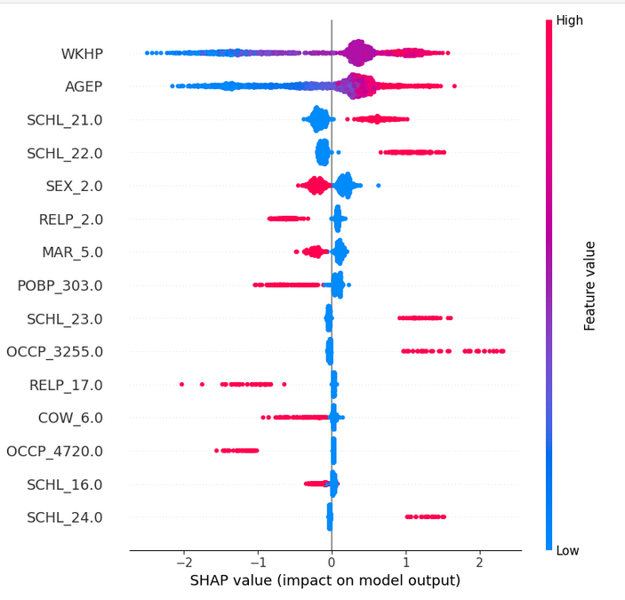
---

#### 3.2.5 Analyse par sous-groupes (TP, TN, FP, FN)

Une analyse par sous-groupes a été réalisée afin de comprendre le comportement du modèle selon le type de prédiction.

True Positives (TP) : les prédictions correctes de revenus élevés sont principalement expliquées par des valeurs élevées de WKHP, AGEP et SCHL.

True Negatives (TN) : les faibles revenus sont associés à des valeurs faibles de ces mêmes attributs.

False Positives (FP) : le modèle surestime parfois le revenu lorsque certaines catégories professionnelles ou niveaux d’éducation sont présents, malgré des heures travaillées plus faibles.

False Negatives (FN) : des individus avec un revenu élevé réel peuvent être mal classés lorsque certains attributs discriminants (ex. profession atypique) sont sous-représentés.

Cette analyse montre que certains attributs peuvent effectivement induire le modèle en erreur, notamment lorsqu’ils sont corrélés de manière ambiguë avec le revenu. Elle met en évidence les limites du modèle et les biais potentiels liés à la structure des données.

| True Positives (TP) | True Negatives (TN) |
|---------------------|---------------------|
| 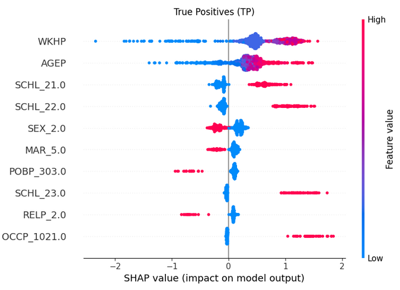 | 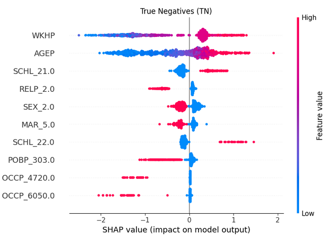|

| False Positives (FP) | False Negatives (FN) |
|----------------------|----------------------|
| 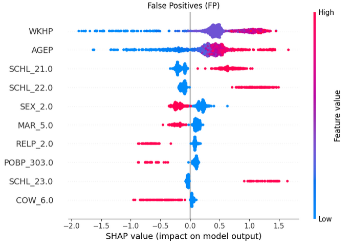 | 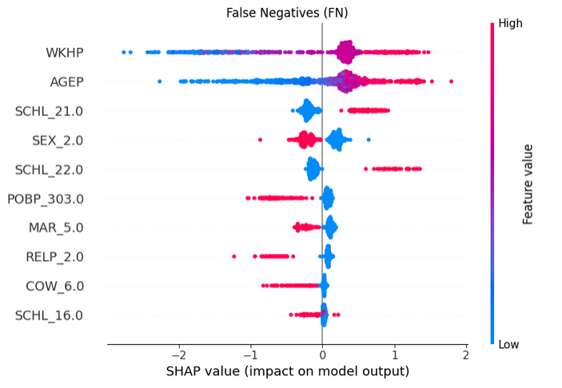|

### 3.3 Explication contrefactuelle

#### Principe

L’explication contrefactuelle consiste à modifier manuellement certaines valeurs d’un individu afin d’observer l’impact de ces changements sur la prédiction du modèle.  
L’objectif est de répondre à la question :  
**“Que faudrait-il changer pour inverser la prédiction du modèle ?”**

#### Implémentation

Nous avons sélectionné un individu du jeu de test et étudié l’impact de la variation de plusieurs attributs continus importants, notamment :
- le nombre d’heures travaillées par semaine (WKHP),
- l’âge (AGEP).

Pour chaque attribut, nous avons fait varier progressivement sa valeur et observé l’évolution de la **probabilité prédite d’appartenir à la classe >50k**.

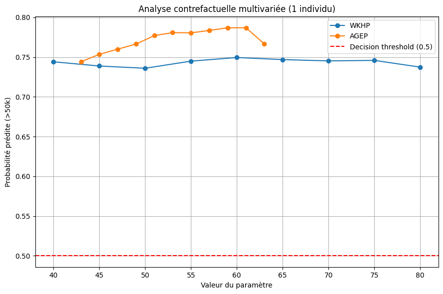
    

#### Résultats et interprétation

Le graphique contrefactuel montre que :
- la probabilité prédite évolue de manière relativement stable pour WKHP,
- l’âge a un impact plus marqué sur la probabilité,
- dans le cas étudié, la prédiction reste au-dessus du seuil de décision (0.5), indiquant une **prédiction robuste**.

Cela signifie que, pour cet individu, des modifications raisonnables des attributs étudiés ne suffisent pas à inverser la décision du modèle.  
Cette analyse met en évidence les limites de l’action individuelle sur la prédiction et renforce la compréhension du comportement global du modèle.

---

